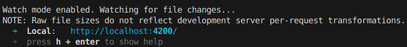

# LabPCP

Projeto Gerado com Angular CLI na versão 18.0.7
Estilização em SCSS

## Como abrir o projeto na sua máquina

Para clonar o respositório digite, no terminal da sua máquina

 ```bash
   git clone git@github.com:SuziHarima/labPCP.git
```
Ou para fazer um fork vá na opção "fork" do respositório do github, que irá gerar uma cópia do projeto na própria página, e então fazer o clone com o comando

  ```bash
   git clone git@github.com:$suaConta/labPCP.git
   ```
Com o projeto clonado para abrir pode ser utilizado a IDE de sua preferrencia.

## Para iniciar

Para rodar o programa deve primeiramente instalar o programa. Abra o terminal, dentro da pasta com o arquivo da aplicação, e digite o comando `ng install`.
Também será necessário, para que a aplicação rode corretamente, adicionar o JSON-server com o comando `npm i -g json-server` e o Angular Material com o comando `ng add @angular/material`.

Com tudo devidamente instalado o programa estará apto para rodar na sua máquina, em seguida, para inicializar, utilize o comando `ng serve`.

Ele irá inicializar na porta 4200 de acordo com a figura abaixo:


Para visualizar na no seu navegador a aplicação basta então seguir o endereço de hiperlink indicado na imagem como "Local:". 


## Sobre o programa

O programa é uma aplicação front-end para uso de unidades de educação, tem o principal intuito auxiliar no gerenciamento das atividades educacionais da instituição, oferecendo telas simples para acompanhamento e gerenciamento para os estudantes e para os gestores a administradores.

Possui um mock data (dados criados artificialmente) para demonstrar como esses dados iriam se apresentar dentro da aplicação.

A aplicação conta com regras de acesso, que irão mostrar dados diferentes dependendo do tipo de usuário logano na sessão, podendo ser aluno, docente ou admnistrador. Cada tipo de usuário tabém conta com uma página inicial diferente e tem liberdade de acesso e modificação de acordo.

As páginas são login, homepage, cadastro de alunos, cadastro de avaliação, cadastro de docente, lista de docentes e notas.

Tem também um menu lateral para facilitar a navegação entre as páginas, que também está configurado para mostrar apenas as páginas disponíveis para o tipo de usuário logado.

## Melhorias

Algumas funcionalidades ainda poderiam ser implementadas, como por exemplo a inserção de login/id no cadastro de aluno, fazendo a integração do aluno com um login para acessar a página.

